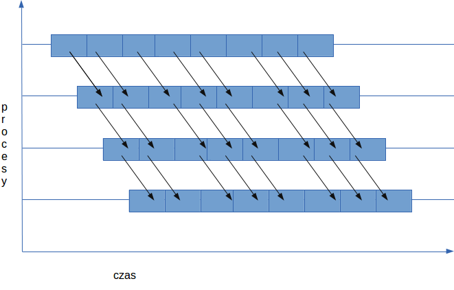

# Wzorzec potokowego przesyłania danych (pipeline)
W wypadku rozsyłania dużych danych często efektywniejsze. Dane rozdielane są na n fragmentów i wysyłane są do kolejnych procesów.\
Program realizuje jednowymiaorwy komunikator z wirtualną topologią kartezjańską i rozsyła wektor int o rozmiarze 1000000 (podział danych na części po 1000 elementów) z procesu 0 do pozostałych procesów przy użyciu potokowego przesyłania danych.
 

## W kodzie MPI topologia kartezjańska służy do:
1. **Ułatwienia identyfikacji sąsiadów w potoku komunikacyjnym:**
    - Funkcja MPI_Cart_shift identyfikuje sąsiadów po obu stronach procesu, zwracając odpowiednie rank (identyfikatory procesów).
    - Zastosowanie kartezjańskiej topologii jednowymiarowej pozwala na automatyczne i łatwe ustalanie sąsiadów, co upraszcza komunikację między nimi.
2. **Obsługi warunków brzegowych:**
    - Procesy na brzegach potoku (proces zerowy oraz ostatni) mają sąsiadów odpowiednio ustawionych jako MPI_PROC_NULL.
    - To ułatwia zarządzanie komunikacją, ponieważ wysyłanie lub odbieranie wiadomości z procesu MPI_PROC_NULL jest bezpieczne i nie powoduje błędów.

## Jak to działa w kodzie 
1. **Tworzenie topologii:**
    - MPI_Cart_create tworzy komunikator z jednowymiarową topologią kartezjańską.
    - dims[0] = size ustawia, że topologia ma tyle procesów, ile dostępnych jest w komunikatorze.
    - periods[0] = 0 wyłącza periodyczność, więc proces zerowy nie ma sąsiada po lewej, a ostatni proces nie ma sąsiada po prawej.
2. **Znajdowanie sąsiadów:**
    - MPI_Cart_shift identyfikuje sąsiadów po obu stronach każdego procesu. Zwraca rank lewego i prawego sąsiada lub MPI_PROC_NULL dla procesów na krańcach.
3. **Komunikacja potokowa:**
    - Przy pomocy zidentyfikowanych sąsiadów każdy proces może odbierać dane od swojego lewego sąsiada, przetwarzać je (lub przechowywać), a następnie wysyłać do prawego sąsiada.
    - Proces zerowy inicjuje komunikację, a pozostałe procesy kontynuują ją zgodnie z ustalonymi sąsiadami.
Stosowanie topologii kartezjańskiej z funkcją MPI_Cart_shift upraszcza przepływ danych i zarządzanie komunikacją w systemie MPI, umożliwiając efektywne i bezbłędne przesyłanie danych między procesami.

## Wymagane biblioteki i instalacja

Aby skompilować i uruchomić ten projekt, potrzebujesz kompilatora obsługującego MPI. Upewnij się, że masz zainstalowane wymagane biblioteki, postępując zgodnie z poniższymi krokami.

1. **MPI (Message Passing Interface):**
   - Pozwala na komunikację między procesami w programach równoległych.
   - Na systemach opartych na Debianie/Ubuntu można zainstalować MPI poprzez:
     ```
     sudo apt-get install mpich
     ```
   - Alternatywnie można użyć implementacji OpenMPI:
     ```
     sudo apt-get install openmpi-bin openmpi-common libopenmpi-dev
     ```

2. **Matematyczna biblioteka (libm):**
   - Typowo zawarta w standardowych kompilatorach C/C++.
   - Nie wymaga dodatkowej instalacji.


## Budowanie projektu za pomocą Makefile

Aby zbudować projekt, użyj polecenia make w katalogu projektu.
Aby zbudować projekt, użyj polecenia make w katalogu projektu.


## Uruchamianie projektu

Po zbudowaniu projektu możesz uruchomić go za pomocą polecenia:
```
make run
```
To uruchoomi program na 8 procesach z użyciem MPI z flagą **--oversubscribe** \
Możesz też uruchomić program ręcznie:
```
mpirun [flagi] -np [liczba procesow] ./a.out
```

## Wyniki

Program w przypadku błedu w przesyle danych wypisuje numer procesu oraz błędny fragment danych.

## Weryfiakcja poprawności

Aby zweryikować poprawność działania programu została dodatkowo zaimplentowan fukcja sprawdziająca poprawność wchodzących i wychodzących danych, jeżeli nie zwraca błedu program działa poprawnie.
