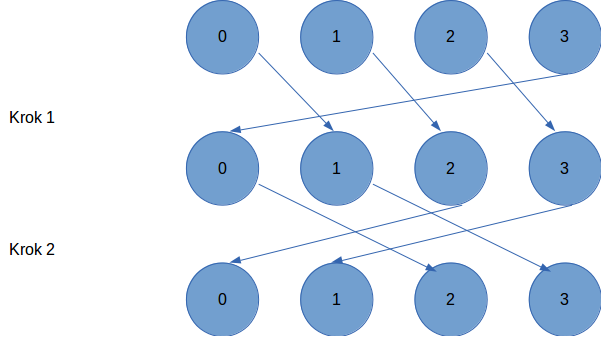

# Upowszechnianie (dissemination pattern)
Wzorzec komunikacyjny „upowszechnianie” (dissemination pattern) pozwala każdemu z procesów wyliczyć wartość rozwiązania w maksimum log p krokach komunikacyjnych, gdzie każdy z procesów otrzymuje częściowe wyniki aby wykonać ostateczną ich redukcję na koniec ostatniego przebiegu przesyłu danych.\
Progrma demonstruje ten wzorzec wykonując obliczenie wspólnego nwd dla każdego procesu.
 

## Wymagane biblioteki i instalacja

Aby skompilować i uruchomić ten projekt, potrzebujesz kompilatora obsługującego MPI. Upewnij się, że masz zainstalowane wymagane biblioteki, postępując zgodnie z poniższymi krokami.

1. **MPI (Message Passing Interface):**
   - Pozwala na komunikację między procesami w programach równoległych.
   - Na systemach opartych na Debianie/Ubuntu można zainstalować MPI poprzez:
     ```
     sudo apt-get install mpich
     ```
   - Alternatywnie można użyć implementacji OpenMPI:
     ```
     sudo apt-get install openmpi-bin openmpi-common libopenmpi-dev
     ```

2. **Matematyczna biblioteka (libm):**
   - Typowo zawarta w standardowych kompilatorach C/C++.
   - Nie wymaga dodatkowej instalacji.


## Budowanie projektu za pomocą Makefile

Aby zbudować projekt, użyj polecenia make w katalogu projektu.
Aby zbudować projekt, użyj polecenia make w katalogu projektu.


## Uruchamianie projektu

Po zbudowaniu projektu możesz uruchomić go za pomocą polecenia:
```
make run
```
To uruchoomi program na 8 procesach z użyciem MPI z flagą **--oversubscribe** \
Możesz też uruchomić program ręcznie:
```
mpirun [flagi] -np [liczba procesow] ./a.out
```

## Wyniki

Program wypisuje na standardowe wyjście numer procesu i obliczony przez niego nwd.

## Weryfiakcja poprawności

Aby zweryikować poprawność działania programu procesy otrzymały statycznie przypisane liczby pierwsze o kolejności pierwszości co najmniej 9 ich nwd wynosi więc 1. Program działa poprawnie gdy każdy proces na końcu ma przypisany ten sam nwd. 